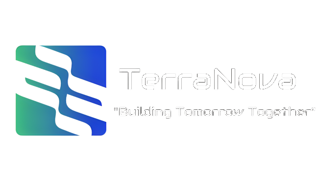

<br/>
<p align="center">
  <a href="https://github.com/Tealspider23/HackOdisha.23">
    
  </a>

  <h3 align="center">Extraterrestrial Habitat Analyser</h3>

  <p align="center">
    Learn . Build . Teach
    <br/>
    <br/>
    <a href="https://github.com/Tealspider23/HackOdisha.23"><strong>Explore the docs »</strong></a>
    <br/>
    <br/>
    <a href="https://github.com/Tealspider23/HackOdisha.23">View Demo</a>
    .
    <a href="https://github.com/Tealspider23/HackOdisha.23/issues">Report Bug</a>
    .
    <a href="https://github.com/Tealspider23/HackOdisha.23/issues">Request Feature</a>
  </p>
</p>

    

## Table Of Contents

* [About the Project](#about-the-project)
* [Built With](#built-with)
* [Getting Started](#getting-started)
  * [Prerequisites](#prerequisites)
  * [Installation](#installation)
* [Usage](#usage)
* [Roadmap](#roadmap)
* [Contributing](#contributing)
* [License](#license)
* [Authors](#authors)
* [Acknowledgements](#acknowledgements)

## About The Project


Creating a machine learning model to predict the habitability of a planet based on satellite data is a complex and ambitious task. It would require a substantial amount of data and expertise in various fields, including astrophysics, geology, and machine learning. Below, I'll outline a high-level approach and suggest some Python libraries and models that could be used as a starting point.

1. *Data Collection*:
   - Gather data about exoplanets and their characteristics, such as distance from their host star, size, atmosphere composition, and more. NASA's Exoplanet Archive is a valuable source for such data.

2. *Feature Engineering*:
   - Extract relevant features from the satellite data. These features might include information about the planet's environment, such as temperature, atmospheric pressure, surface composition, and more.

3. *Data Preprocessing*:
   - Clean and preprocess the data, handling missing values and outliers.

4. *Labeling*:
   - Define a suitable target variable or label that represents the habitability of planets. You may need to consult experts in the field to create a meaningful label.

5. *Model Selection*:
   - Choose an appropriate machine learning model. Given the complexity of the problem, ensemble methods and deep learning architectures like neural networks may be suitable. Some Python libraries to consider include:
     - Scikit-Learn: For traditional machine learning algorithms.
     - TensorFlow or PyTorch: For deep learning models.
     
6. *Model Training*:
   - Split your dataset into training and testing sets.
   - Train your chosen model on the training data.

7. *Model Evaluation*:
   - Evaluate the model's performance using appropriate metrics such as accuracy, precision, recall, F1-score, and possibly domain-specific metrics related to habitability.

8. *Hyperparameter Tuning*:
   - Fine-tune your model's hyperparameters to improve its performance.

9. *Interpretability and Visualization*:
   - Use techniques like SHAP (SHapley Additive exPlanations) or LIME (Local Interpretable Model-agnostic Explanations) to interpret and explain model predictions.
   - Visualize the results to gain insights into the factors affecting habitability predictions.

10. *Deployment*:
    - Once you have a satisfactory model, you can deploy it as a web service or integrate it into other applications for real-world use.

11. *Continuous Monitoring and Improvement*:
    - Continuously monitor the model's performance and update it as new data becomes available or as you gather more insights.

Keep in mind that creating a model for planet habitability is a complex task and may require collaboration with experts in astronomy and planetary science. Additionally, it's crucial to have a substantial and high-quality dataset to train a reliable model. This is a broad and ongoing research area, and the success of such a model would depend on the quality of data and domain knowledge integrated into the model's design.

## Built With

This was built with the help of next.js and typescript . 

## Getting Started

To get a copy , follow the steps - clone the repository and run it on local environment with help of Live server

### Prerequisites

basic knowledge of Machine Learning and the blocks of Web Development

* npm

```sh
npm install npm@latest -g
```

### Installation

1. Get a free API Key at [https://example.com](https://example.com)

2. Clone the repo

```sh
git clone https://github.com/your_username_/Project-Name.git
```

3. Install NPM packages

```sh
npm install
```

4. Enter your API in `config.js`

```JS
const API_KEY = 'ENTER YOUR API';
```

## Usage

Use this space to show useful examples of how a project can be used. Additional screenshots, code examples and demos work well in this space. You may also link to more resources.

_For more examples, please refer to the [Documentation](https://example.com)_

## Roadmap

See the [open issues](https://github.com/Tealspider23/HackOdisha.23/issues) for a list of proposed features (and known issues).

## Contributing

Contributions are what make the open source community such an amazing place to be learn, inspire, and create. Any contributions you make are **greatly appreciated**.
* If you have suggestions for adding or removing projects, feel free to [open an issue](https://github.com/Tealspider23/HackOdisha.23/issues/new) to discuss it, or directly create a pull request after you edit the *README.md* file with necessary changes.
* Please make sure you check your spelling and grammar.
* Create individual PR for each suggestion.
* Please also read through the [Code Of Conduct](https://github.com/Tealspider23/HackOdisha.23/blob/main/CODE_OF_CONDUCT.md) before posting your first idea as well.

### Creating A Pull Request

1. Fork the Project
2. Create your Feature Branch (`git checkout -b feature/AmazingFeature`)
3. Commit your Changes (`git commit -m 'Add some AmazingFeature'`)
4. Push to the Branch (`git push origin feature/AmazingFeature`)
5. Open a Pull Request

## License

Distributed under the MIT License. See [LICENSE](https://github.com/Tealspider23/HackOdisha.23/blob/main/LICENSE.md) for more information.


